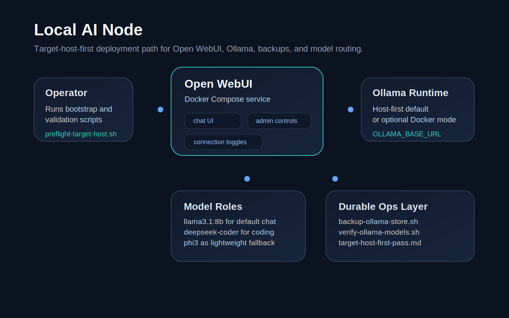
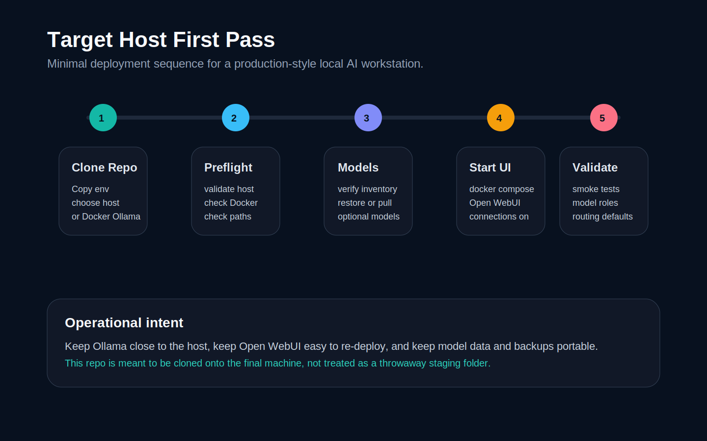

# Local AI Node

This repository is a simple, production-friendly starting point for a target Unix/Linux Local AI Node. Its primary job is to run Ollama plus Open WebUI cleanly, with host-based Ollama as the default path and Dockerized Ollama as an explicit alternative.

The repo is intended to be the canonical deployment codebase. Push this to Git, migrate it to the final host by cloning, and move model data separately through backup/restore or fresh pulls. Router, RAG, and related automation stay secondary to the base node flow.

## Planned model roles

- normal chat: `llama3.1:8b`
- coding: `deepseek-coder:6.7b`
- fast/light tasks: `phi3`
- embeddings: `nomic-embed-text`
- optional larger text model: `gemma4:31b` or `qwen3:30b`
- optional vision: `llava:13b`

This repo now treats the four-model core set as the required baseline. Larger
text models and vision are optional so the node stays responsive while Docker,
storage, monitoring, and later RAG services share the machine.

## Screenshots




## Repository layout

```text
.
├── .env.example
├── .env.staging.example
├── README.md
├── backups/
├── configs/
│   ├── ollama/
│   └── open-webui/
├── docker-compose.yml
├── docker-compose.ollama.yml
├── docs/
│   ├── model-router.md
│   ├── migration-checklist.md
│   ├── performance-tuning.md
│   ├── rag-pipeline.md
│   ├── security-review.md
│   └── validation-checklist.md
├── rag-data/
│   ├── chroma/
│   ├── documents/
│   └── faiss/
├── scripts/
│   ├── backup-ollama-store.sh
│   ├── check-open-webui-connectivity.sh
│   ├── load-env.sh
│   ├── preflight-target-host.sh
│   ├── restore-ollama-store.sh
│   └── verify-ollama-models.sh
└── volumes/
    ├── ollama-data/
    └── open-webui-data/
```

## Prerequisites

- Docker Engine with Docker Compose plugin
- `curl`
- `rsync`
- Ollama installed on the target host if you use Option A

## Quick start paths

- Current staging machine: `cp .env.staging.example .env`
- Final target host: `cp .env.example .env`
- First target-host deployment guide: [docs/target-host-first-pass.md](/Users/basho00/_github/_personal/Local-LLM/docs/target-host-first-pass.md)
- Primary operating flow: preflight, pull/restore models, verify inventory, start Open WebUI, validate connectivity

## Step 1: prepare the environment

Copy the example environment file:

```bash
cp .env.example .env
```

If you are using the current staging/download machine, you can start from:

```bash
cp .env.staging.example .env
```

Edit `.env` and choose one `OLLAMA_BASE_URL`:

- Option A, Ollama on the host: `http://host.docker.internal:11434`
- Option B, Ollama in Docker Compose: `http://ollama:11434`

Set a real `WEBUI_SECRET_KEY` before using this beyond a trusted local network.

## Step 2: choose your Ollama deployment mode

### Option A: Ollama on the host

Use this when you want the model store and Ollama runtime managed directly on the Unix/Linux host. This is the default path in this repo.

1. Install Ollama on the host.
2. Restore or copy your staged model store into `~/.ollama` on the target machine.
3. Confirm Ollama is reachable:

```bash
curl http://localhost:11434/api/tags
```

4. Start Open WebUI only:

```bash
docker compose up -d
```

5. In Open WebUI admin settings, enable the Ollama connection for `http://host.docker.internal:11434` if the model dropdown is empty.

### Option B: Ollama in Docker

Use this when you want both services managed by Docker Compose.

1. Set `OLLAMA_BASE_URL=http://ollama:11434` in `.env`.
2. Start Open WebUI and Ollama together:

```bash
docker compose -f docker-compose.yml -f docker-compose.ollama.yml up -d
```

3. Confirm Ollama is reachable:

```bash
curl http://localhost:11434/api/tags
```

4. In Open WebUI admin settings, enable the Ollama connection for `http://ollama:11434` if the model dropdown is empty.

### Option C: Remote Open WebUI host

Use this when Ollama runs on one machine and Open WebUI runs on a different Docker-capable host.

Typical layout:
- this Mac or another node runs Ollama on `11434`
- a separate Linux or Docker host runs Open WebUI
- Open WebUI points to the Ollama node over the network

Example on the Open WebUI host:

```bash
cp .env.example .env
```

Set:

```bash
OLLAMA_BASE_URL=http://OLLAMA_NODE_IP:11434
```

Then start Open WebUI on the remote host:

```bash
docker compose up -d
```

Before doing this, confirm from the Open WebUI host that it can reach the Ollama node:

```bash
curl http://OLLAMA_NODE_IP:11434/api/tags
```

If security policy allows only private network access, keep this traffic on a trusted LAN or VPN.

## Step 3: verify the model inventory

If Open WebUI loads but shows no models, check `Admin Settings -> Connections` and make sure the configured Ollama API connection is enabled.

Run the inventory check:

```bash
./scripts/verify-ollama-models.sh
```

If the host needs the default core model set first:

```bash
./scripts/pull-required-models.sh
```

The primary operator flow for this repo is:

1. `./scripts/preflight-target-host.sh`
2. `./scripts/pull-required-models.sh` if the host needs fresh models
3. `./scripts/verify-ollama-models.sh`
4. `docker compose up -d`
5. `./scripts/check-open-webui-connectivity.sh`

Use the bootstrap wrapper only if you want one convenience command for the same first-pass flow:

```bash
./scripts/bootstrap-local-ai-node.sh
```

Include optional models in the convenience flow:

```bash
EXPECT_OPTIONAL_MODELS="gemma4:31b,llava:13b" ./scripts/bootstrap-local-ai-node.sh
```

Run target-host preflight directly before the first deployment:

```bash
./scripts/preflight-target-host.sh
```

Optional smoke tests:

```bash
RUN_SMOKE_TESTS=true ./scripts/verify-ollama-models.sh
RUN_SMOKE_TESTS=true EXPECT_OPTIONAL_MODELS="gemma4:31b,llava:13b" ./scripts/bootstrap-local-ai-node.sh
```

## Download models on a new system

After `ollama` is installed, pull the required core model set with:

```bash
./scripts/pull-required-models.sh
```

Pull a specific optional model with:

```bash
OPTIONAL_MODELS="gemma4:31b" ./scripts/pull-required-models.sh
```

Other valid optional pulls:

```bash
OPTIONAL_MODELS="qwen3:30b" ./scripts/pull-required-models.sh
OPTIONAL_MODELS="llava:13b" ./scripts/pull-required-models.sh
```

Avoid pulling multiple heavyweight text models unless you have a specific need
to compare them. The intended default is one fast general model, one coding
model, one lightweight fallback, one embedding model, and optionally one larger
text model plus vision.

To inspect the exact manifest and blob files for a model before moving it to a
new system, run:

```bash
./scripts/show-model-files.sh gemma4:31b
./scripts/show-model-files.sh llava:13b
```

This prints the manifest path plus every blob file referenced by that model.

## First RAG workflow

The repo now includes a minimal local RAG path built on top of Ollama
embeddings, a local JSON index, and a small local runtime layer.

1. Put source files in `rag-data/documents/`.
2. Build the index:

```bash
python3 ./scripts/build-rag-index.py
```

3. Inspect retrieval results:

```bash
python3 ./scripts/query-rag.py "What models are part of the core stack?"
```

4. Generate an answer from retrieved context:

```bash
python3 ./scripts/rag-answer.py "What is the deployment flow for the target host?"
```

Use `RAG_CHAT_MODEL=gemma4:31b` when you want a stronger final answer model.

## How This Actually Works

`rag-data/documents/` is the source-of-truth context directory for the first
RAG implementation. Put the text material you want the system to know there:
- notes
- docs
- runbooks
- config references
- logs you want to search

The current pipeline is:
1. `build-rag-index.py` reads files from `rag-data/documents/`
2. it chunks the text
3. it embeds each chunk with `nomic-embed-text`
4. it writes a local index to `rag-data/chroma/rag-index.json`
5. `query-rag.py` and `rag-answer.py` retrieve relevant chunks
6. the final answer is generated with `llama3.1:8b` or `gemma4:31b`

## Open WebUI Relationship

Open WebUI remains the UI layer. The current add-on direction is:
- Open WebUI can keep talking to Ollama directly for the base node flow
- or Open WebUI can talk to the router's OpenAI-compatible endpoint for routed and grounded behavior
- the router remains the front door
- RAG stays inside the same packaged runtime instead of depending on a second local HTTP hop

## Smart Router API

The repo now also includes a single smart router endpoint so callers do not
need to choose a model manually every time.

Start it:

```bash
./scripts/start-router-service.sh
```

Single-process packaged router + RAG flow:

```bash
./scripts/start-local-ai-runtime.sh
```

Compatibility wrapper:

```bash
./scripts/start-router-rag-stack.sh
```

Connectivity check:

```bash
./scripts/check-router-connectivity.sh
```

Health check:

```bash
curl http://127.0.0.1:8788/health
```

Simple chat endpoint:

```bash
curl -X POST http://127.0.0.1:8788/chat \
  -H "Content-Type: application/json" \
  -d '{"question":"What is our target architecture?"}'
```

OpenAI-style endpoint:

```bash
curl -X POST http://127.0.0.1:8788/v1/chat/completions \
  -H "Content-Type: application/json" \
  -d '{
    "model":"local-ai-node-auto",
    "messages":[
      {"role":"user","content":"What is our deployment flow?"}
    ],
    "stream":false
  }'
```

Router behavior today:
- repo and node questions use the RAG path
- coding questions use `deepseek-coder:6.7b`
- short utility prompts can use `phi3`
- general chat falls back to `llama3.1:8b`

This is the path to the UI talking to one endpoint directly instead of asking
you to choose a model every time.

## Open WebUI Through The Router

The recommended end-state is:
- Open WebUI talks to the router, not directly to Ollama
- the router decides whether to use RAG, coding, light, or normal chat
- Open WebUI uses the router's OpenAI-compatible endpoint
- the default model in the UI becomes `local-ai-node-auto`

Repo defaults now support that mode through environment variables in
`.env.example` and `.env.staging.example`.

### Recommended startup order

1. Make sure Ollama is running on the host.
2. Build the RAG index:

```bash
python3 ./scripts/build-rag-index.py
```

3. Start the single-process runtime:

```bash
./scripts/start-local-ai-runtime.sh
```

Or use the compatibility wrapper:

```bash
./scripts/start-router-rag-stack.sh
```

4. Validate the router:

```bash
./scripts/check-router-connectivity.sh
RUN_SMOKE_TESTS=true ./scripts/check-router-connectivity.sh
```

5. Start Open WebUI:

```bash
docker compose up -d
```

### Router-mode Open WebUI settings

Recommended `.env` values:

```bash
ENABLE_OLLAMA_API=false
ENABLE_OPENAI_API=true
OPENAI_API_BASE_URL=http://host.docker.internal:8788/v1
OPENAI_API_KEY=local-ai-node
```

### What you should see in the UI

- an OpenAI-compatible backend provided by the local router
- the `local-ai-node-auto` model id available from the model list
- one default model choice in the UI that routes automatically underneath
- in `Admin Settings -> Connections`, the OpenAI connection for `http://host.docker.internal:8788/v1` enabled if it exists but is disabled

This does not eliminate the model selector from Open WebUI itself, but it means
you can keep the UI on `local-ai-node-auto` for normal use instead of manually
switching between `llama3.1`, `deepseek-coder`, `phi3`, and `gemma4`.

## Step 4: verify Open WebUI connectivity

Run the connectivity check:

```bash
./scripts/check-open-webui-connectivity.sh
```

Then open:

```text
http://localhost:3000
```

## No-Docker note

If Docker is unavailable, the host-based Ollama path still works.

What still works without Docker:
- Ollama model serving
- model verification
- generation and embedding smoke tests
- backup and restore
- repo development and migration prep

What does not work from this repo without Docker:
- the packaged Open WebUI Compose deployment
- the Dockerized Ollama option

If Docker is blocked but Python or Node package installs are allowed, a non-Docker Open WebUI install may still be possible in user space. This machine has Python, pip, Node, and npm available, so that path is worth checking if you want UI access before the final Linux deployment.

## Step 5: back up or restore the Ollama model store

Back up `~/.ollama` to the backup path in `.env`:

```bash
./scripts/backup-ollama-store.sh
```

Restore from a specific backup:

```bash
CONFIRM_RESTORE=true ./scripts/restore-ollama-store.sh /mnt/nas/local-ai-node/ollama-backups/ollama-home-YYYYMMDD-HHMMSS
```

The restore script creates a safety backup of the current target directory before copying data in.

### Backup path examples

Local directory:

```bash
BACKUP_ROOT_DIR=$HOME/local-ai-node/backups
```

Mounted NAS on macOS:

```bash
BACKUP_ROOT_DIR=/Volumes/MyNAS/local-ai-node-backups
```

Mounted NAS on Linux:

```bash
BACKUP_ROOT_DIR=/mnt/nas/local-ai-node-backups
```

To confirm what your current `.env` is set to:

```bash
grep -E '^(BACKUP_ROOT_DIR|OLLAMA_HOME_DIR)=' .env
```

## Notes on migration

- Keep this repo in Git and treat it as the deployment source of truth.
- Move model data separately from Git.
- Host-based Ollama is the simpler path if you want direct control over `~/.ollama`.
- Docker-based Ollama is easier to keep self-contained but may complicate migrations if you later switch storage layouts.
- A NAS can be used for backup and migration, but it is not required and should not be the live Ollama model directory.

Use [docs/migration-checklist.md](/Users/basho00/_github/_personal/Local-LLM/docs/migration-checklist.md) before moving to another host and [docs/validation-checklist.md](/Users/basho00/_github/_personal/Local-LLM/docs/validation-checklist.md) after setup.

For host-based Ollama service management, see [configs/ollama/systemd-setup.md](/Users/basho00/_github/_personal/Local-LLM/configs/ollama/systemd-setup.md) and [configs/ollama/ollama.service](/Users/basho00/_github/_personal/Local-LLM/configs/ollama/ollama.service).

## Secondary add-ons and future work

The base repo goal is still a reliable Ollama + Open WebUI node. The router and RAG docs below are add-on tracks once the base stack is stable:

- [docs/model-router.md](/Users/basho00/_github/_personal/Local-LLM/docs/model-router.md)
- [docs/rag-pipeline.md](/Users/basho00/_github/_personal/Local-LLM/docs/rag-pipeline.md)
- [docs/security-review.md](/Users/basho00/_github/_personal/Local-LLM/docs/security-review.md)
- [docs/performance-tuning.md](/Users/basho00/_github/_personal/Local-LLM/docs/performance-tuning.md)

RAG is now implemented as a small local add-on path. Keep it narrow: local documents, local JSON index, and a single-process runtime behind the router.

## Quick Repo Summary

- Purpose: This repository is a simple, production-friendly starting point for a target Unix/Linux Local AI Node.
- Primary path: host-based Ollama plus Dockerized Open WebUI.
- Stack: Docker
- Base node status: ready for the core Ollama + Open WebUI flow.
- Add-on status: router heuristics, image routing, incremental rebuilds, and single-process packaged runtime are implemented.
- Next add-on step: validate router mode and the packaged runtime on another system.

## LLM Start Here
- `README.md`
- `graphify-out/GRAPH_REPORT.md`
- `docker-compose.yml`
- `graphify-out/repo-semantic-summary.md`

## License

This repository is proprietary and released under [All Rights Reserved](LICENSE).
